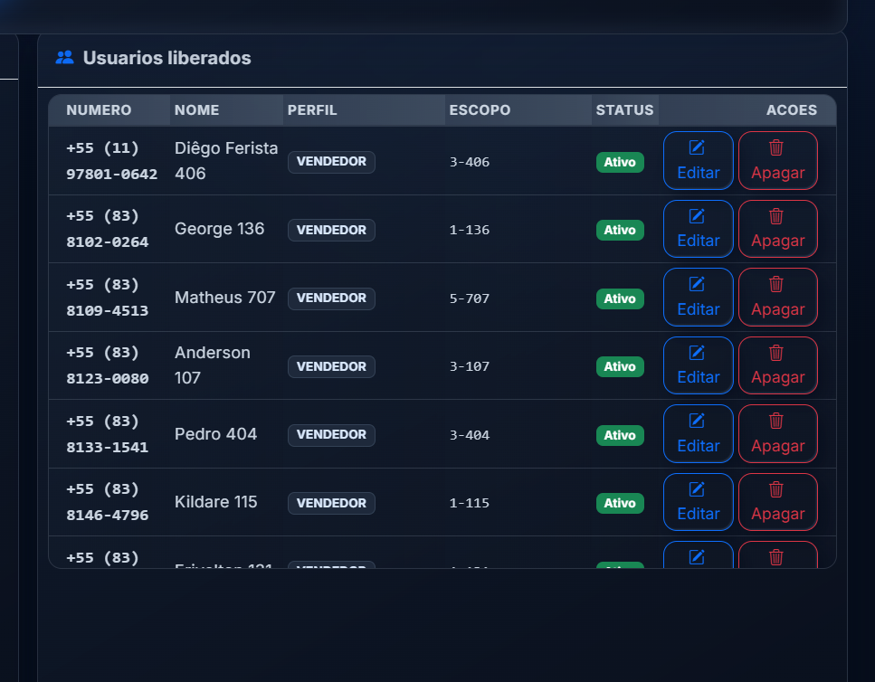
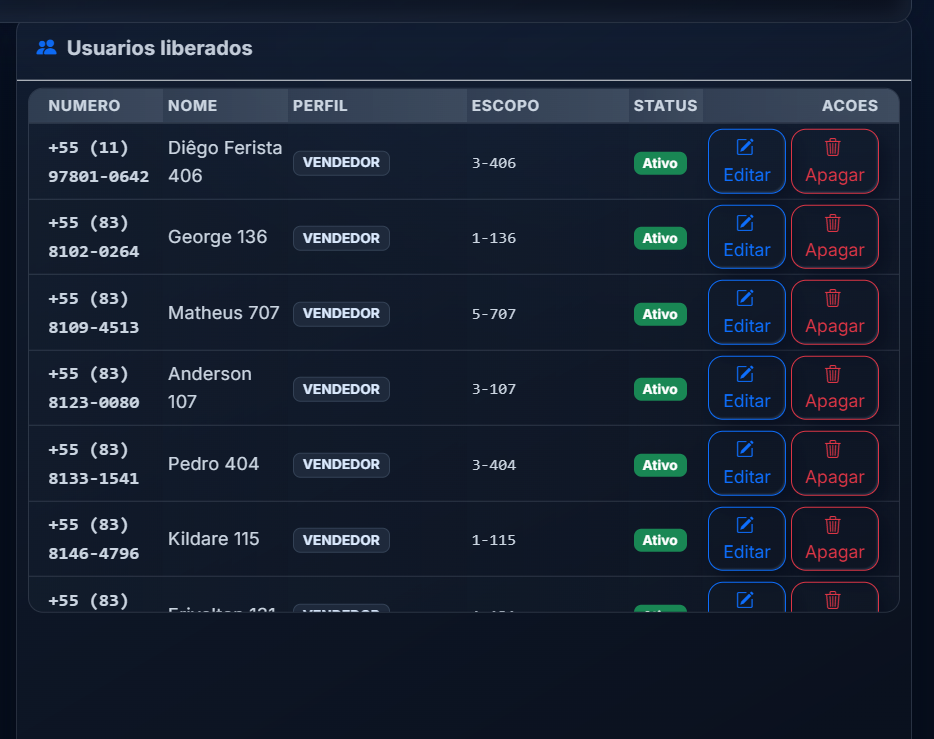
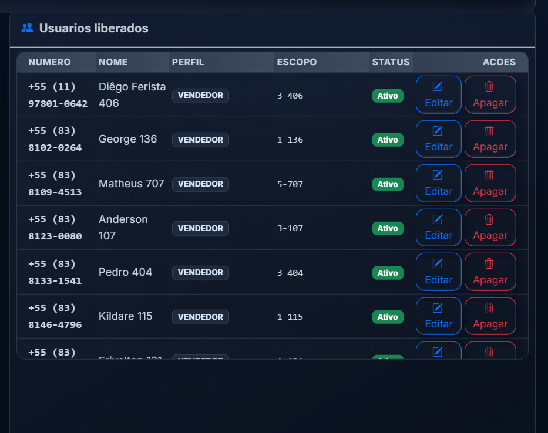
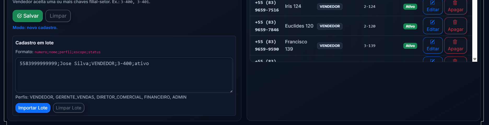

# Regras Operacionais dos Fluxos

Este arquivo registra as boas praticas que devem guiar futuras mudancas nos fluxos conversacionais do bot.

## 1. Fluxos por dia

Para consultas amplas de `rota`, `giro` e `inadimplencia`, o padrao preferencial e:

`ia -> GV -> setor -> cliented`

Aplicacao pratica:
- a tela do dia mostra apenas o resumo geral do dia e a lista de GVs
- a tela do GV mostra apenas o resumo daquele GV e a lista de setores
- a tela do setor mostra apenas o detalhe final dos clientes

## 2. Pular etapas desnecessarias

Quando houver apenas uma opcao real:
- se existir apenas um `GV`, pular a selecao de GV
- se existir apenas um `setor`, pular a selecao de setor

Nao obrigar o usuario a confirmar uma etapa sem escolha real.

## 3. Evitar redundancia

Nao repetir no corpo da mensagem o mesmo resumo que ja aparece nas descricoes das opcoes.

Padrao:
- corpo da mensagem: somente o contexto necessario para a decisao atual
- descricao da opcao: detalhes comparativos para a escolha

## 4. Regra de giro

`Giro` representa quantidade de caixas, nao moeda.

Por isso:
- nao usar `R$` em metricas de giro
- nao usar virgula como se fosse formato monetario
- nao manter zeros artificiais em quantidades

Exemplos corretos:
- `Caixas 10`
- `Faltam 8`
- `Caixas 12.5`

Exemplos incorretos:
- `Caixas 10,00`
- `Faltam 8,00`
- `R$ 10` para valores de giro

## 5. Regra de contagem em inadimplencia por dia

Nos fluxos de risco financeiro por dia, usar linguagem baseada em `cliente(s)` quando a metrica representa pessoas/empresas em risco.

Evitar misturar:
- `clientes com risco`
- `visitas com risco`

na mesma camada de resumo quando o dado mostrado e cliente.

## 6. Escopos

Hierarquia comercial:
- `RN` -> setor
- `GV` -> conjunto de setores do GV
- `DC` -> conjunto de GVs por filial
- `financeiro` / `admin` -> visao ampla

Sempre respeitar essa hierarquia ao resumir e ao detalhar.

## 7. Validacao obrigatoria

Sempre que mexer em fluxo conversacional:
- atualizar testes de parser e roteamento
- rebuildar o `bot_api` no Docker
- validar os fluxos reais afetados

## 8. Linguagem do vendedor

No perfil de vendedor, preferir linguagem de acao e rotina.

Padroes recomendados:
- `Risco da Rota` em vez de termos genericos ou financeiros demais
- `Cobranca da Carteira` para diferenciar da consulta de risco do dia
- `Giro` com foco em oportunidade de caixa, nunca como valor monetario
- `Carteira` com leitura operacional: base, cobranca, giro, rota e risco

Evitar no escopo do vendedor:
- blocos gerenciais como `Resumo dos GVs` quando ele ja esta na ponta
- repeticoes do mesmo resumo entre corpo e opcoes
- textos longos que atrasem a proxima acao

## 9. Linguagem da gerencia (GV)

No perfil de `gerente_vendas`, separar com clareza:
- atalhos operacionais no menu principal
- visoes consolidadas no submenu `Gerencia`

Padroes recomendados:
- menu principal: `Cobranca da Gerencia` e `Giro da Gerencia`
- submenu `Gerencia`: `Cobranca Consolidada` e `Giro Consolidado`
- `Equipe` deve explicitar que o recorte e por setor da equipe
- em risco por dia, usar o titulo `Risco da Rota` para manter consistencia

Comandos de referencia:

```bash
docker compose up -d --build bot_api
docker compose exec -T bot_api python -B -m unittest tests.test_customer_lookup_flow_routing tests.test_customer_lookup_flow_parsers
```

## 10. Design das mensagens do bot

Para respostas finais no WhatsApp, priorizar leitura rapida em celular.

Padrao visual recomendado:
- titulo curto na primeira linha
- identificacao do cliente ou escopo logo abaixo
- uma linha em branco entre blocos
- bloco com titulo em negrito: `*Nome do Bloco:*`
- campos do bloco em linhas com `- Campo: valor`
- quando a informacao pertence ao mesmo item, pode usar `|`

Exemplo:

```text
Analise Financeira

Cliente: O COMILAO
Revenda: 3 | NB: 9845 | Setor: 407
RN: 407 | GV: 4
CPF: 737.314.474-87 | CNPJ: -

*Prazo e Limite:*
- Prazo atual: 5
- Cond. pag.: 505
- Limite total: R$ 80.000,00
- Pag. em atraso: 18%

*Faturamento:*
- Jan: R$ 92.256,85 | Pedidos: 4 | Media por pedido: R$ 23.064,21
```

Evitar:
- blocos longos sem separacao visual
- repetir a mesma informacao em corpo e opcao de menu
- misturar tabela extensa com texto corrido
- usar `Documentacao 1` e `Documentacao 2`; prefira um documento por linha
- quebrar um mesmo cliente em muitas linhas quando couber em uma linha objetiva

Aplicacao pratica:
- `analise`, `inadimplencia`, `documentacao`, `giro`, `comodatos`, `rota` e resumos financeiros devem seguir esse padrao sempre que forem respostas finais
- menus podem continuar compactos, mas as descricoes das opcoes devem ajudar a decisao sem repetir todo o resumo
